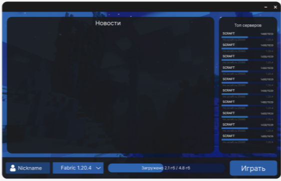
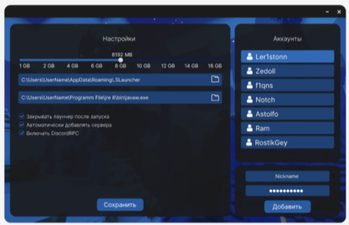

 

<h2 align="center">
 ChersLauncher v0.1 
</h2>

 

  - Игровой лаунчер для Minecraft где вы можете играть в своё удовольствие так как в нашем лаунчере много разных функций и возможностей которые разнообразят ваш геймплей -
 

<h3>

|&emsp;&emsp;
 [Wiki](https://github.com/zexfolloff/ChersLauncher/wiki)
&emsp;&emsp;|&emsp;&emsp;
 [Download](https://github.com/zexfolloff/ChersLauncher/releases)
&emsp;&emsp;|&emsp;&emsp;
 [Helps](https://discord.com/invite/wUsBj3xBZh)
&emsp;&emsp;|

</h3>

---
##  Установка лаунчера:
  * У вас должна быть установлена [Java Runtime v1.8](https://java.com) 

  *  Сначало скачайте [Java Runtime v1.8](https://java.com)  она нужна для того чтобы лаунчер запустился, после того как вы всё скачали запустите скачанный установочный файлы и дождитесь установки

  *  Если вам не хочется долго искать нужную [Java Runtime v1.8](https://java.com) тогда скачайте наше приложение [JavaInstaller](https://github.com/zexfolloff/JavaInstaller) чтобы быстро установить нужную версию Java Runtime на ваш компьютер

  *  После установки перезагрузите компьютер!

  *  Если у вас уже установлена Java v1.8 перезагружать компьютер не нужно!
---

*  Не запускается лаунчер, вылетает игра или проблемы с установкой?
  * Пишите нам в [тех.поддержку](https://discord.com/invite/wUsBj3xBZh) мы поможем вам в кратчайшие сроки

---
## •  /  [ Система Авторизация и Регистрация: ](https://github.com/zexfolloff/screenshots)

 

 

## •  [ Главное меню лаунчера: ](https://github.com/zexfolloff/screenshots)

 

## •  [ Меню настроек: ](https://github.com/zexfolloff/screenshots)

 

---

## •  [ Выбор модов для игры: ](https://github.com/zexfolloff/screenshots)

 

## •  [ Установка Java: ](https://github.com/zexfolloff/screenshots)

 

## •  [ Скачивания игры: ](https://github.com/zexfolloff/screenshots)

 

## •  [ Запуск игры: ](https://github.com/zexfolloff/screenshots/)

 

---

## •  [ DiscordRPC: ](https://github.com/zexfolloff/DiscordRPC-CustomApp)

 

