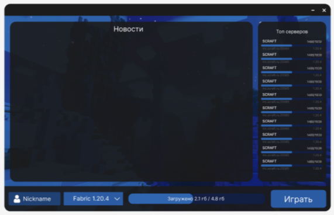

 

<h2 align="center">
 ChersLauncher v0.1
</h2>

 

  представляем вам новый лаунчер нового поколения для Minecraft
 

<h3>

|&emsp;&emsp;
[Wiki](https://github.com/zexfolloff/ChersLauncher/wiki)
&emsp;&emsp;|&emsp;&emsp;
[Download](https://github.com/zexfolloff/ChersLauncher/releases)
&emsp;&emsp;|&emsp;&emsp;
[Helps](https://discord.com/invite/wUsBj3xBZh)
&emsp;&emsp;|

</h3>

---
## Установка лаунчера:
  * У вас должна быть установлена Java Runtime v1.8

  * Сначало скачайте [Java Runtime v1.8](https://java.com) она нужна чтобы лаунчер запустился, после того как вы всё скачали запустите скачанный установочный файлы и дождитесь установки

  * Если вам не хочется долго искать нужную [Java Runtime v1.8](https://java.com) тогда скачайте наше приложение [JavaInstaller](https://github.com/zexfolloff/JavaInstaller) чтобы быстро установить нужную версию Java Runtime на ваш компьютер

  * После установки перезагрузите компьютер!

  * Если у вас уже установлена ​​Java v1.8 перезагружать компьютер не нужно!
---
* Не запускается лаунчер, вылетает игра или проблемы с установкой?
  * Пишите нам в [тех.поддержку](https://discord.com/invite/wUsBj3xBZh) мы поможем вам в кратчайшие сроки
---
## • [Главное меню:](https://github.com/zexfolloff/screenshots/mainForm.png)

 

## • [Меню настроек:](https://github.com/zexfolloff/screenshots/settingsForm.png)

 

## • [Меню выбора версии:](https://github.com/zexfolloff/screenshots/selectVersion.png)

 

## • NEW | [DiscordRPC:](https://github.com/zexfolloff/DiscordRPC-CustomApp)

 

