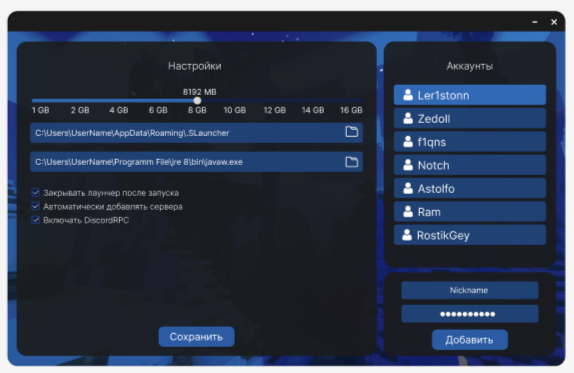

 

<h2 align="center">
 ChersLauncher v1.0 
</h2>

 

  Игровой лаунчер для Minecraft где вы можете играть в своё удовольствие в нашем лаунчере вы найдёте много разных функций и возможностей которые разнообразят ваш геймплей
 

<!--
<h5 align="center">

 |&emsp;&emsp;
 [скачано:](https://github.com/zexfolloff/ChersLauncher)
 &emsp;&emsp;|&emsp;&emsp;
 [просмотров:](https://github.com/zexfolloff/ChersLauncher)
 &emsp;&emsp;|&emsp;&emsp;

</h5>
-->

<h3>
 
|&emsp;&emsp;
[Wiki](https://github.com/zexfolloff/ChersLauncher/wiki)
&emsp;&emsp;|&emsp;&emsp;
[Helps](https://discord.com/invite/kPZWnKnmVe)
&emsp;&emsp;|&emsp;&emsp;

|&emsp;&emsp;
[Download](https://github.com/zexfolloff/ChersLauncher/releases)
&emsp;&emsp;|&emsp;&emsp;
 
</h3>

---

## • Установка лаунчара 
   -  Чтобы начать игру нужно достаточно скачать последнюю версию нашего лаунчера в [release](https://github.com/zexfolloff/ChersLauncher/releases) Наш лаунчер автоматически скачает нужные библиотеки и дополнения для того чтобы ваша игра не зависала и ваш юыло комфортно играть ;)
     <!-- - ( --- ) -->
<!--
   -  Скачайте последнюю версию [Java Runtime JDK v1.8](https://github.com/zexfolloff/ChersLauncher/releases/JavaInstaller)  она нужна для того чтобы лаунчер запустился и игра работала стабильно, после этого ожидайте установку
     <!-- - ( --- )

   -  Если вам не хочется долго искать нужную [Java Runtime JDK v1.8](https://github.com/zexfolloff/ChersLauncher/releases)  тогда скачивайте наше приложение [JavaInstaller](https://github.com/zexfolloff/ChersLauncher/releases/JavaInstaller)  чтобы быстро установить новую и нужную вам версию [Java Runtime JDK](https://java.com) на ваш компьютер
     <!-- - ( --- )

   -  После установки вам предложат перезагрузить компьютер, нажмите согласиться на перезагрузку
     <!-- - ( --- )

   -  Если у вас уже установлена [Java Runtime JDK v1.8](https://java.com)  перезагружать и устанавливать заново на компьютер не нужно!
     <!-- - ( --- )
-->

---

## • Тех.Поддержка 
   -  Возникли проблемы с установкой лаунчера или игра не запускается?
     -  Пишите нам в [тех.поддержку](https://discord.com/invite/wUsBj3xBZh) мы поможем вам как можно быстрее :)

---
## • Авторизация и Регистрация 

 

 

## • Главное меню 

 

## • Меню настроек 

 

---
<!--
## • Установка библиотек для игры 

 

-->

## • Скачивания Minecraft 

 

## • Запуск игры 

 

<!---

## • Авторизации через Discord 

 

## • Авторизации через Microsoft 

 

## • Авторизации через Telegram 

 

## • Авторизации через Xbox 

 

